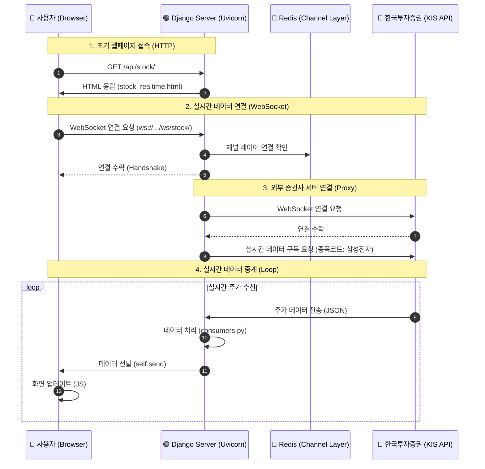

# System Architecture & Data Flow

이 프로젝트의 전체 데이터 흐름을 시각화한 다이어그램입니다.

### 흐름 상세 설명

1.  **웹페이지 접속**: 사용자가 사이트에 접속하여 HTML 파일을 받아옵니다.
2.  **WebSocket 연결**: 브라우저가 Django 서버와 WebSocket 연결을 맺습니다. 이때 Django는 `settings.py`에 설정된 **Redis**를 통해 채널 레이어를 확인합니다.
3.  **외부 API 연결**: Django 서버(Consumer)가 중간자 역할을 합니다. 사용자 대신 **한국투자증권(KIS) 서버**에 별도로 WebSocket을 연결하고, '삼성전자' 주가 데이터를 달라고 요청합니다.
4.  **데이터 중계**: 증권사 서버에서 주가 변동 데이터가 날아오면, Django가 이를 받아서 그대로 사용자 브라우저에게 토스(Relay)해 줍니다.

> **참고**: `Redis`는 Django 서버의 프로세스가 여러 개일 때도 안정적으로 메시지를 관리하기 위해 뒤에서 동작합니다.
